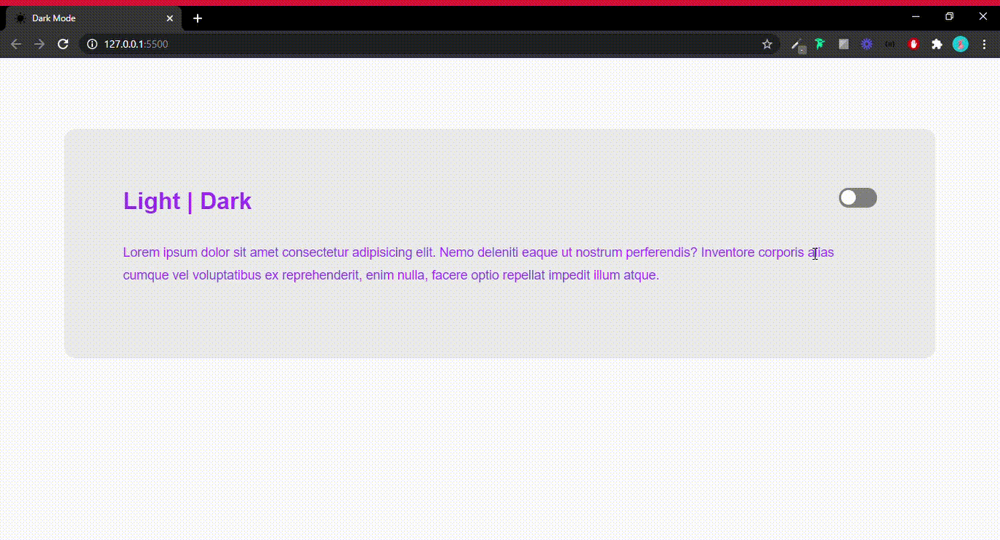

<h1
  align="center"
>
  
</h1>

<h2
  align="center"
>
  This code repository is for the 30 day CSS challenge
</h2>

 

<h2
  align="center"
>
  DESAFIOS
</h2>

<h3
  align="capitalize"
>
  ONE Challenge
</h3>
 

<h2
 align="center"
>
  
  DARK ROOT MODE
</h2>

Dark Root mode created with HTML, CSS and JavaScript. Creation of a simple modal with HTML and CSS, and changing the theme with JavaScript manipulating the HTML DOM. This little application was created with inspiration from the video by [Mayk Brito](https://github.com/maykbrito) and [Rocketseat](https://github.com/rocketseat-education). To access the playlist code / drops for this class on youtube click on this [link](https://www.youtube.com/playlist?list=PL85ITvJ7FLoifcDIBeuuAhh4_799RZaSc).

<h1
  align="center"
>
  
</h1>
